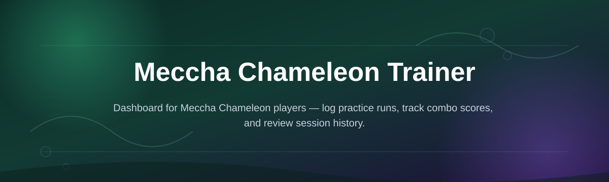
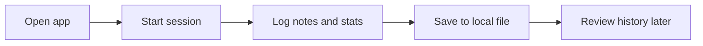

# meccha-chameleon-trainer-dashboard

  

| Requirement | Minimum |
|---|---|
| OS | Windows 10 or 11 (64-bit) |
| Install | None — standalone executable |
| Toolchain | Not required |
| Disk space | ~150 MB |

*A desk companion for Meccha Chameleon Trainer players who'd rather track progress on a screen than in a notebook.*

## What this is

This project started as a spreadsheet. A few of us running long-term Meccha Chameleon Trainer sessions got tired of writing down stat changes, encounter notes, and training milestones by hand between play sessions. The spreadsheet worked for about a week, then it turned into six spreadsheets, none of which agreed with each other. That's the honest origin of **meccha-chameleon-trainer-dashboard** — a small Windows app built to replace that mess with one screen that stays open next to the game.

What it does now is simpler than it sounds: it gives Meccha Chameleon Trainer players a place to log training runs, watch trends over time, and keep notes tied to specific sessions instead of scattered across sticky notes. It doesn't touch game files or memory — it's a companion tool you run alongside the game, not inside it. If you've ever lost track of which run produced which result, this is the tool that origin story was solving for.

  

The button above opens the project's landing page, where the current build is available to download.

## Who it is for

- **Long-session players** who run multiple Meccha Chameleon Trainer sessions a week and lose track of which changes came from which run.
- **New contributors** looking for a small, well-scoped codebase to make their first pull request against.
- **Note-takers and completionists** who want a permanent record instead of loose text files.
- **Stream or video creators** who reference past training runs on camera and need a clean visual to show.
- **Community moderators** compiling shared reference data from multiple players' sessions.

## What you can do

- **Log training sessions** with timestamps, notes, and outcome tags.
- **Compare runs side by side** to spot patterns across your history.
- **Track recurring events** you've flagged as worth watching.
- **Export session logs** to a plain text or CSV file for sharing.
- **Pin favorite sessions** so they don't get buried under newer entries.
- **Search past notes** by keyword instead of scrolling manually.
- **Run fully offline** — nothing is sent anywhere while you use it.
- **Switch between light and dim display modes** for long sessions.

## Getting started

1. Open the landing page using the download button on this page.
2. Download the latest Windows build listed there.
3. Extract the folder anywhere on your machine (no installer needed).
4. Run the `.exe` file directly — Windows may show a first-run prompt, which is normal for unsigned indie tools.
5. Start a new session log and begin tracking.

## Requirements

- Windows 10 or 11, 64-bit.
- No Python, Node, or build tools needed — it's a standalone executable.
- No admin rights required for normal use.
- Roughly 150 MB of free disk space for the app and your saved logs.

## How it works

The dashboard is intentionally simple under the hood: it's a local app that reads and writes its own log files, nothing more.

1. You launch the app and start or resume a session.
2. Entries you type are saved locally as you go, not just on exit.
3. The dashboard renders your history as a browsable list, not a raw file dump.
4. Comparisons and exports pull from that same local history.
5. Closing the app doesn't lose anything — logs persist between runs.

## Common Pitfalls

**Why doesn't my session data show up after restarting the app?**
Check that you extracted the full downloaded folder rather than running the `.exe` from inside a zip archive — Windows sometimes blocks writes when running directly from a compressed file.

**Can I use this while the game is running in fullscreen?**
Yes. The dashboard doesn't read game memory or overlay anything, so it runs independently in its own window regardless of how the game is displayed.

**Does this sync across multiple computers?**
Not currently. Logs are stored locally, so if you switch machines, export your session data first and import it manually on the other side.

**Why did my export come out empty?**
This usually means the session wasn't saved before exporting. Make sure you see the "saved" indicator in the session view before exporting logs.

**Is there a mobile version?**
No — this is a Windows desktop tool. There's no mobile build planned right now, since most long-session tracking happens at a desk anyway.

## Troubleshooting

- **App won't open / Windows flags it as unrecognized:** This is expected for an unsigned indie build. Choose "More info → Run anyway" in the SmartScreen prompt.
- **Window opens but appears blank:** Resize the window slightly — a rare rendering glitch on some display scaling settings can leave the first paint incomplete.
- **Logs seem to disappear between sessions:** Confirm you're launching the same copy of the `.exe` each time; running a second extracted copy creates a separate, empty log file.
- **Export button does nothing:** Check that a session is actively open. Exports run against the current session, not the entire history, by design.

## License

Released under the [MIT License](LICENSE). This is an independent, unofficial companion tool built by fans for tracking personal Meccha Chameleon Trainer sessions; it is not affiliated with or endorsed by the game's original creators.

  

